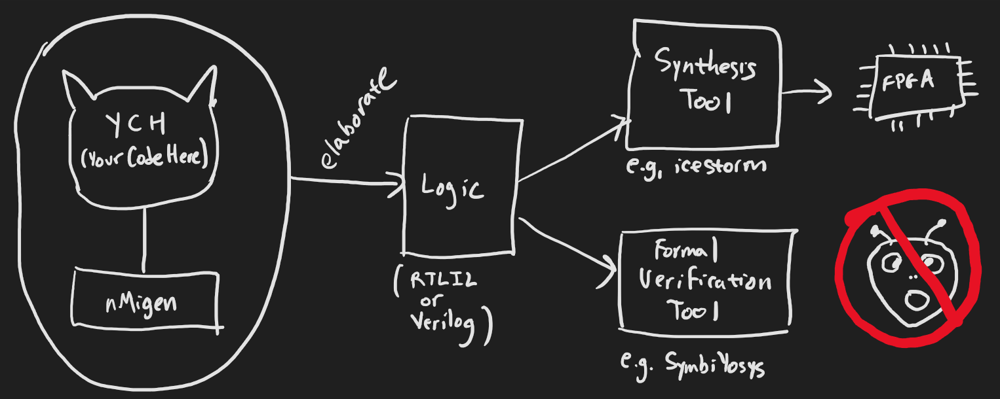
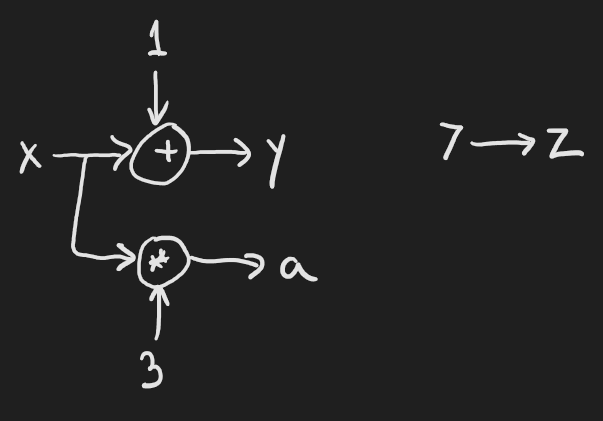
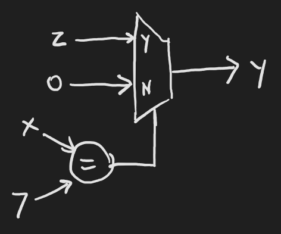
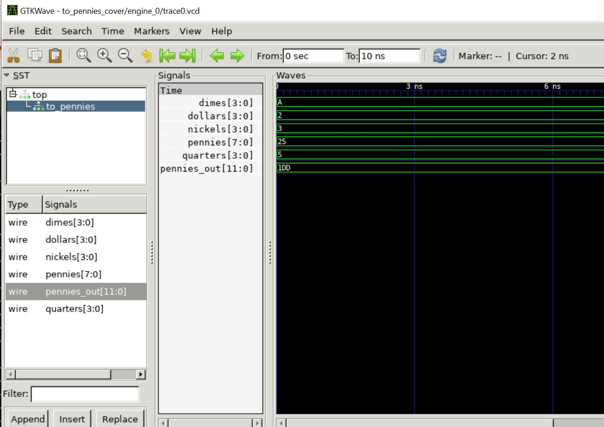

# Exercise 1: Counting coin

<div style="text-align: right"> Khajiit has knowledge... if you have coin.</div>

---
## What you'll do:

Create a module that takes as inputs:

* A number of pennies, from 0 to 255
* A number of nickels (5-penny pieces), from 0 to 15
* A number of dimes (10-penny pieces), from 0 to 15
* A number of quarters (25-penny pieces), from 0 to 15
* A number of dollars (100-penny pieces), from 0 to 15

And outputs the equivalent number of pennies you have.


Use formal verification to:

* Cover the case where the inputs are: 37 pennies, 3 nickels, 10 dimes, 5 quarters, and 2 dollars.
* Cover the case where the output is 548 pennies.
* Cover the case where the output is 64 pennies, and there are twice as many nickels as there are dimes, and there is at least one dime.
* Prove that if there are no input pennies, then the number of output pennies is always a multiple of 5.
* Prove that the number of output pennies, modulo 5, will always equal the number of input pennies, modulo 5, regardless of the other inputs.

## Step 1: Create a module

A *module* is a Python class that has inputs and outputs, and code that generates the logic for the desired functionality. Note that I didn't say code that *implements* the function. A key concept is that nMigen is a Python library for writing logic. When the module is *elaborated*, your code runs and nMigen outputs the corresponding logic.

You can think of the logic that nMigen writes as an integrated circuit, and the code that you write as the instructions for how to create a copy of that integrated circuit.

Modules can use other modules (*submodules*), and you can have as many copies of the module as you want. Your design has one top-level module that contains all of your other modules. When you elaborate the top-level module, nMigen outputs its logic into a file. That file can then be given to other software for synthesis on an FPGA, or for formal verification (i.e. bug hunting).



You can use the `skeleton.py` file to start. Some key features here are:

* Your class is derived from `Elaboratable`
* Your public (or visible) inputs and outputs are attributes of the class.
* The class has an `elaborate` function that gets called by nMigen to generate the logic.
* The class has a class-level `formal` method for verifying your logic.
* You can run your class to generate the output.

## Step 2: Create input and output signals

A `Signal` in nMigen is a wire or register with some number of bits. For example:

```python
x = Signal(5)      # creates a 5-bit signal named "x".
self.y = Signal()  # creates a 1-bit signal named "y" which is an attribute of the class.
```

Think about the input and output signals you'll need, and how many bits each will have to be to represent the range of values they need. Then add them in the `__init__` function of your class.

## Step 3: Write the logic

For this exercise, the logic is completely *combinatorial*: the outputs depend directly on the inputs, with no stored state. In later exercises we will look at *synchronous* logic. The logic-creating statements that you write are added to a *domain*, which can be the combinatorial domain, or a synchronous domain. Here's an example of how to assign signal `x` to signal `y` combinatorically:

```python
m.d.comb += y.eq(x)
```

This is just like writing `y = x`, except using the nMigen library, which requires using the `eq` function. That function returns a statement which can then be added to one of the domains in the module. Here, `m.d.comb` is the module's combinatorial domain.

You can use constants, and arithmetic functions, too:

```python
m.d.comb += y.eq(x + 1)
m.d.comb += z.eq(7)
m.d.comb += a.eq(x * 3)
```



What happens if you assign the same signal twice?

```python
m.d.comb += y.eq(0)
m.d.comb += y.eq(x + 1)
```

It's always the last statement that takes precedence, so `y` will be set to `x+1`, not `0`.

### The if-statement

In Python, you can write something like this:

```python
y = 0
if x == 7:
    y = z
```

The equivalent in nMigen is:

```python
m.d.comb += y.eq(0)
with m.If(x == 7):
    m.d.comb += y.eq(z)
```

In this way, you can conditionally assign `y`. You can even use `else`:

```python
with m.If(x == 7):
    m.d.comb += y.eq(z)
with m.Else():
    m.d.comb += y.eq(0)
```

This does the same thing.



## Step 4: Make sure it compiles!

You can quickly check that there aren't any syntax errors by just generating the code:

```
python3 your_class.py gen
```

## Step 5: Write some formal verification code

Formal verification is a way of showing that your code does what you claim it does. It's more powerful than unit tests because while a unit test says, "given this input, I expect this output", formal verification can say, "this is always true". In a sense, formal verification is a unit test for all inputs and outputs.

Formal verification can also help you see how your logic can get into some specified condition. This is called "covering".

Write your formal verification code in the `formal` function of the class. This function returns two things: the module with formal verification logic (just like `elaborate` does), and the signals that the formal verification engine is allowed to manipulate (effectively your inputs).

### Assertions

You can assert that a condition is always true by using an `Assert` statement:

```python
m.d.comb += Assert(self.x == self.y)               # Assert that x is always the same as y.
m.d.comb += Assert((self.x == 1) & (self.y == 2))  # Assert that x is always 1 and y is always 2.
m.d.comb += Assert(self.x == 1 and self.y == 2)    # This is a syntax error.
```


Note that we can't use Python's `and` like in that last assertion. This is because we are writing logic, and what we really need is a logic bitwise and. Also note the careful placement of parentheses. We have to add these parentheses because in Python, bitwise operators have lower precedence than comparisons. So these two statements are very different:

```python
m.d.comb += Assert((x == 7) & y)  # Assert that x is always 7 and y is always 1.
m.d.comb += Assert(x == 7 & y)    # Assert that x is always (7 bitwise anded with y).
m.d.comb += Assert(x == 7 and y)  # This is a syntax error.
```


When the formal verification engine runs, it tries to falsify any of your assertions. If it can't, you win! But if it can, it will show you what inputs it used to make your assertion fail. Then you can debug.

By the way, if-statements also work for asserts:

```python
with m.If(x == 7)
    m.d.comb += Assert(y)
```

This means, if `x` is `7`, then `y` must be `1`. Otherwise we make no assertion about `y`.

### Covers

You can ask the formal verification engine to manipulate the inputs to make some condition true. For example:

```python
m.d.comb += Cover(self.output == 3)               # What inputs lead to the output being 3?
m.d.comb += Cover(self.output == 2 * self.input)  # What inputs lead to the output being twice the input?
```

If the engine cannot satisfy a cover, it will complain. This usually means that your cover condition is impossible to achieve, and you'll have to debug to find out why. If a cover can be achieved, then the engine will show you what inputs it used to make it happen.

### Your turn

Write the asserts and covers according to the requirements of the exercise. Compile again to make sure you haven't introduced any syntax errors.

```
python3 your_class.py gen
```

## Step 6: Run the formal verification engine for covers

Running your code with `gen` will have it output a file `toplevel.il`. This can be run through the SymbiYosys formal verification tool. It requires a `.sby` configuration file, which I've included in `answers/to_pennies.sby`.

```
python3 your_class.py gen
sby -f answers/to_pennies.sby cover
```

First, look for the cover conditions to be satisfied. These are the `Reached cover statement at...` lines below. And, if all your cover statements were satisfied, you'll get a `DONE (PASS, rc=0)` line.

```
SBY 15:17:27 [answers/to_pennies_cover] Removing directory 'answers/to_pennies_cover'.
SBY 15:17:27 [answers/to_pennies_cover] Copy 'toplevel.il' to 'answers/to_pennies_cover/src/toplevel.il'.
SBY 15:17:27 [answers/to_pennies_cover] engine_0: smtbmc z3
SBY 15:17:27 [answers/to_pennies_cover] base: starting process "cd answers/to_pennies_cover/src; yosys -ql ../model/design.log ../model/design.ys"
SBY 15:17:27 [answers/to_pennies_cover] base: finished (returncode=0)
SBY 15:17:27 [answers/to_pennies_cover] smt2: starting process "cd answers/to_pennies_cover/model; yosys -ql design_smt2.log design_smt2.ys"
SBY 15:17:27 [answers/to_pennies_cover] smt2: finished (returncode=0)
SBY 15:17:27 [answers/to_pennies_cover] engine_0: starting process "cd answers/to_pennies_cover; yosys-smtbmc -s z3 --presat -c --noprogress -t 1  --append 0 --dump-vcd engine_0/trace%.vcd --dump-vlogtb engine_0/trace%_tb.v --dump-smtc engine_0/trace%.smtc model/design_smt2.smt2"
SBY 15:17:27 [answers/to_pennies_cover] engine_0: ##   0:00:00  Solver: z3
SBY 15:17:27 [answers/to_pennies_cover] engine_0: ##   0:00:00  Checking cover reachability in step 0..
SBY 15:17:27 [answers/to_pennies_cover] engine_0: ##   0:00:00  Reached cover statement at answers/to_pennies.py:45 in step 0.
SBY 15:17:27 [answers/to_pennies_cover] engine_0: ##   0:00:00  Writing trace to VCD file: engine_0/trace0.vcd
SBY 15:17:27 [answers/to_pennies_cover] engine_0: ##   0:00:00  Writing trace to Verilog testbench: engine_0/trace0_tb.v
SBY 15:17:27 [answers/to_pennies_cover] engine_0: ##   0:00:00  Writing trace to constraints file: engine_0/trace0.smtc
SBY 15:17:27 [answers/to_pennies_cover] engine_0: ##   0:00:00  Checking cover reachability in step 0..
SBY 15:17:27 [answers/to_pennies_cover] engine_0: ##   0:00:00  Reached cover statement at answers/to_pennies.py:53 in step 0.
SBY 15:17:27 [answers/to_pennies_cover] engine_0: ##   0:00:00  Writing trace to VCD file: engine_0/trace1.vcd
SBY 15:17:27 [answers/to_pennies_cover] engine_0: ##   0:00:00  Writing trace to Verilog testbench: engine_0/trace1_tb.v
SBY 15:17:27 [answers/to_pennies_cover] engine_0: ##   0:00:00  Writing trace to constraints file: engine_0/trace1.smtc
SBY 15:17:27 [answers/to_pennies_cover] engine_0: ##   0:00:00  Checking cover reachability in step 0..
SBY 15:17:27 [answers/to_pennies_cover] engine_0: ##   0:00:00  Reached cover statement at answers/to_pennies.py:51 in step 0.
SBY 15:17:27 [answers/to_pennies_cover] engine_0: ##   0:00:00  Writing trace to VCD file: engine_0/trace2.vcd
SBY 15:17:27 [answers/to_pennies_cover] engine_0: ##   0:00:00  Writing trace to Verilog testbench: engine_0/trace2_tb.v
SBY 15:17:27 [answers/to_pennies_cover] engine_0: ##   0:00:00  Writing trace to constraints file: engine_0/trace2.smtc
SBY 15:17:27 [answers/to_pennies_cover] engine_0: ##   0:00:00  Status: passed
SBY 15:17:27 [answers/to_pennies_cover] engine_0: finished (returncode=0)
SBY 15:17:27 [answers/to_pennies_cover] engine_0: Status returned by engine: pass
SBY 15:17:27 [answers/to_pennies_cover] summary: Elapsed clock time [H:MM:SS (secs)]: 0:00:00 (0)
SBY 15:17:27 [answers/to_pennies_cover] summary: Elapsed process time [H:MM:SS (secs)]: 0:00:00 (0)
SBY 15:17:27 [answers/to_pennies_cover] summary: engine_0 (smtbmc z3) returned pass
SBY 15:17:27 [answers/to_pennies_cover] summary: trace: answers/to_pennies_cover/engine_0/trace0.vcd
SBY 15:17:27 [answers/to_pennies_cover] summary: trace: answers/to_pennies_cover/engine_0/trace1.vcd
SBY 15:17:27 [answers/to_pennies_cover] summary: trace: answers/to_pennies_cover/engine_0/trace2.vcd
SBY 15:17:27 [answers/to_pennies_cover] DONE (PASS, rc=0)
```

The cover statements aren't found in the order you put them in your code!

Each cover statement found generates a trace where you can see the inputs and outputs, as well as some intermediate signals if they are there, using `gtkwave`:

```
gtkwave -f answers/to_pennies_cover/engine_0/trace0.vcd
```

In this case, the first trace came from the first cover statement in the exercise. The output shows `1DD`, or 477.



## Step 7: Run the formal verification engine for bounded model checking

```
sby -f answers/to_pennies.sby bmc
```

"BMC" stands for Bounded Model Checking. More on this later exercises. If all assertions succeed, then you'll get a `DONE (PASS, rc=0)` line at the end. If not, you'll get a trace that you can look at.

```
SBY 15:17:28 [answers/to_pennies_bmc] Removing directory 'answers/to_pennies_bmc'.
SBY 15:17:28 [answers/to_pennies_bmc] Copy 'toplevel.il' to 'answers/to_pennies_bmc/src/toplevel.il'.
SBY 15:17:28 [answers/to_pennies_bmc] engine_0: smtbmc z3
SBY 15:17:28 [answers/to_pennies_bmc] base: starting process "cd answers/to_pennies_bmc/src; yosys -ql ../model/design.log ../model/design.ys"
SBY 15:17:28 [answers/to_pennies_bmc] base: finished (returncode=0)
SBY 15:17:28 [answers/to_pennies_bmc] smt2: starting process "cd answers/to_pennies_bmc/model; yosys -ql design_smt2.log design_smt2.ys"
SBY 15:17:28 [answers/to_pennies_bmc] smt2: finished (returncode=0)
SBY 15:17:28 [answers/to_pennies_bmc] engine_0: starting process "cd answers/to_pennies_bmc; yosys-smtbmc -s z3 --presat --noprogress -t 1  --append 0 --dump-vcd engine_0/trace.vcd --dump-vlogtb engine_0/trace_tb.v --dump-smtc engine_0/trace.smtc model/design_smt2.smt2"
SBY 15:17:28 [answers/to_pennies_bmc] engine_0: ##   0:00:00  Solver: z3
SBY 15:17:28 [answers/to_pennies_bmc] engine_0: ##   0:00:00  Checking assumptions in step 0..
SBY 15:17:28 [answers/to_pennies_bmc] engine_0: ##   0:00:00  Checking assertions in step 0..
SBY 15:17:41 [answers/to_pennies_bmc] engine_0: ##   0:00:13  Status: passed
SBY 15:17:41 [answers/to_pennies_bmc] engine_0: finished (returncode=0)
SBY 15:17:41 [answers/to_pennies_bmc] engine_0: Status returned by engine: pass
SBY 15:17:41 [answers/to_pennies_bmc] summary: Elapsed clock time [H:MM:SS (secs)]: 0:00:13 (13)
SBY 15:17:41 [answers/to_pennies_bmc] summary: Elapsed process time [H:MM:SS (secs)]: 0:00:13 (13)
SBY 15:17:41 [answers/to_pennies_bmc] summary: engine_0 (smtbmc z3) returned pass
SBY 15:17:41 [answers/to_pennies_bmc] DONE (PASS, rc=0)
```

## Stumped?

The answer to this exercies is in `answers/to_pennies.py`.
